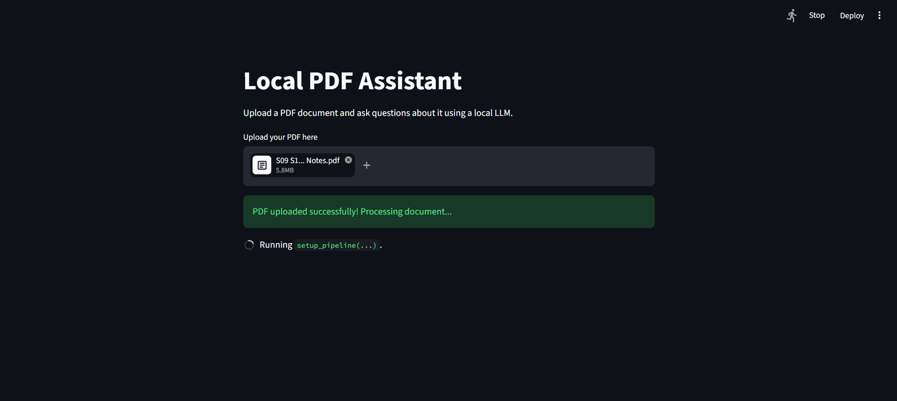
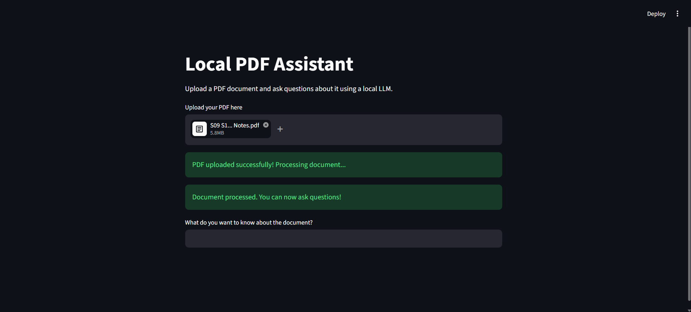
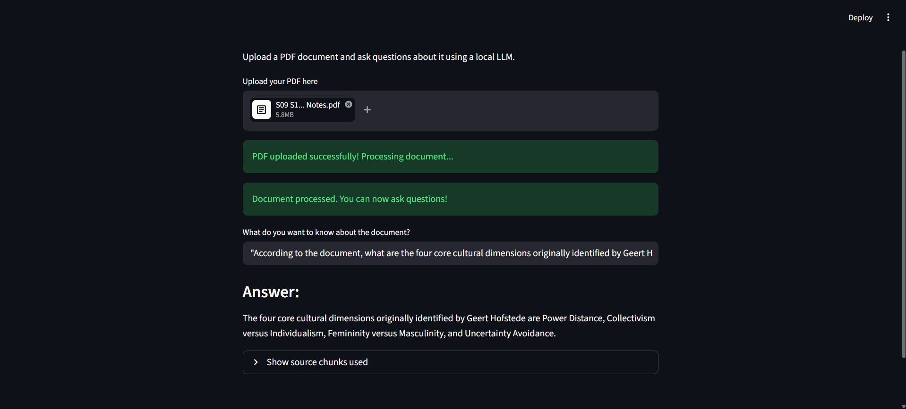

# Lab exercise 3
# Yago Búa López

## 1. Problem Description
The objective of this exercise is to design and implement an application that utilizes a local Large Language Model (LLM) to perform an advanced language-related task. Simple prompt-response interactions often lack context when dealing with specific, user-provided documents. Therefore, the problem addressed by this application is how to enable a user to extract information and ask questions about a personal PDF document, while keeping all data local to ensure privacy.

## 2. System Design and Workflow
To solve this problem, the application uses a Retrieval-Augmented Generation (RAG) architecture. The workflow is divided into two main phases:

**Phase 1: Preprocessing and Indexing**
1. **Document Loading:** The system reads the PDF uploaded by the user.
2. **Text Splitting:** The document is divided into smaller, manageable chunks (1000 characters each) to fit the context window of the LLM.
3. **Embeddings:** Each chunk is converted into a vector representation (embedding) and stored in a local vector database (Chroma).

**Phase 2: Retrieval and Generation**
4. **Query Processing:** The user inputs a question through the graphical interface.
5. **Retrieval:** The system searches the vector database for the top 3 text chunks most semantically similar to the user's question.
6. **Generation:** A prompt is constructed containing the user's question and the retrieved context. This prompt is sent to the local LLM, which generates a final, contextualized answer.

## 3. Model Selection and Justification
For this project, I selected two local models running via **Ollama**:
* **Generative Model:** `mistral` (Mistral 7B). This model was chosen because it offers an excellent balance between performance and hardware requirements. It generates high-quality text and follows instructions accurately, making it ideal for answering questions based on context.
* **Embedding Model:** `nomic-embed-text`. I chose this specific model because it is highly optimized for text retrieval tasks and runs efficiently on local hardware compared to larger generative models.

Using Ollama allows the system to remain completely local, ensuring data privacy and reducing latency related to network requests to external APIs.

## 4. Implementation Details
The application was developed using the following tools and frameworks:
* **Streamlit:** Used to build the Graphical User Interface (GUI). It provides a simple and effective way to handle file uploads, text inputs, and display results.
* **LangChain (v0.2.x):** A framework used to orchestrate the RAG pipeline. It handles the connections between the document loaders (`PyPDFLoader`), text splitters, vector stores, and the LLM.
* **ChromaDB:** A lightweight, local vector database used to store and retrieve the embeddings.

The code includes an added value by displaying the specific source chunks used to generate the answer, providing transparency to the user.

## 5. Discussion of Results, Limitations, and Possible Improvements
**Results:** The system successfully processes PDF documents and provides accurate answers based on the text. The Streamlit interface makes it easy to use, and running the LLM locally ensures privacy. Overcoming dependency issues (like LangChain version conflicts with newer Python versions) was a key part of the development process.

**Limitations:**
* **Hardware Constraints:** The generation speed heavily depends on the local machine's specifications. On standard CPUs, the response time can be slow.
* **Complex Formatting:** The `PyPDFLoader` might struggle with complex PDF layouts, such as multiple columns or tables, which can affect the quality of the retrieved context.

**Possible Improvements:**
1. **Chat History:** Implement a conversational memory so the LLM remembers previous questions within the same session.
2. **Advanced Retrieval:** Use techniques like "Parent Document Retriever" or re-ranking to improve the accuracy of the retrieved chunks.

## 6. Screenshots of the Application

Here is the application in action:

### Initial User Interface

### Processing a PDF Document

### Question Answering with Source Chunks
